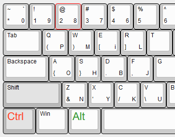

# ahk-onehand-typing

The script is my personal solution to my personal problem. If you find it useful you are welcome to use it or collaborate on.

## Problem

There are limited number of objects that a person can keep in attention simultaneously, and exactly one object that can be focused on.
That's why it is very common case when you periodically need to refocus between keyboard and API, IDE, status bar, mouse etc. each time losing spending attention and getting tired of finding the place you switched from.
Even skilled blind typing sometimes requires a person to take a look on keyboard to press some key, especially when it needs to input some special symbol or even backspace.
Also sometimes it is more comfortable and faster to switch between programs or make text selections with mouse rather than keyboard.
Therefore it could be nice if we have an opportunity to manipulate keyboard with one hand absolutely not looking at it.

## Solution

The script lets you remap your keyboard for using left hand only. Both characters and special symbols are remapped.
There are corresponding notifications in the left corner of your screen of when remapping mode is enabled and which keys are remapped (and how they are remapped).

This approach decreases your typing rate compared to classic two-hands style but if you get enough practice the advantage of instantly staying focused on important things will be more valuable than the drawback of slow typing.

Some letter remappings were created to associatively match corresponding original key.

For example,

- [q] is horizontally mirrored to [p],
- [d] to [b],
- [W] (vertically) to [M],
- [Z] is rotated to [N],
- [f] to [j].

Some bindigs were chosen with phonetical or visual similarities:

- [c] => [k],
- [e] => [i],
- [V] => [U].

Other keys were placed due to their use rate or other considerations:

- [ X ] => [Y],
- [S] => [H],
- [A] => [O],
- [R]ight => [L]eft

## How to use

1. download and install autohotkey from [AHK Home Page](https://www.autohotkey.com)
2. start or compile [one-hand-typing.ahk](start.ahk)

## Special keys

- press RALT or LSHIFT+LCTRL => enable global handle. All key bindings below are available if only global handle is enabled
- hold LALT => enable letter keys remap
- hold LCTRL+LALT => enable special keys remap instead of letters
- LCTRL+2 => ENTER
- LCTRL+3 => LCTRL+ENTER
- LCTRL+1 => LCTRL+LSHIFT+ENTER
- CAPSLOCK => BACKSPACE
- All other info (letters, number and special symbols) could be read in tooltip when LALT or LALT+LCTRT are held

## TODO

- DEL key is still not remapped
